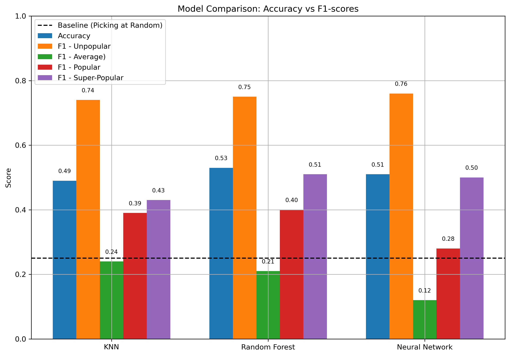

# Tweet Virality Prediction

Data analysis of social networks remains one of the most compelling fields for applying statistical tools and machine learning models, offering the practical advantage of predicting trends and identifying behavioral patterns.  

Predicting viral trends is particularly valuable in contexts where companies and advertisers aim to **optimize ad diffusion strategies** by investing in the most shareable and engaging posts.  

For these reasons, we analyze **10K+ tweets** from the [Codecademy platform](https://www.codecademy.com) (course: *Build a Machine Learning Model*), with the goal of predicting whether a tweet becomes viral. The dataset includes several columns, such as the raw tweet text, timestamp, number of favorites, number of retweets, and others.

### Project Overview

Using a **quartile-based division** of the retweet count distribution, we classify tweet virality into four categories:  
- `unpopular` – bottom 25% of tweets  
- `average` – tweets between the 25th and 50th percentiles  
- `popular` – tweets between the 50th and 75th percentiles  
- `super popular` – top 25% of tweets  

We then perform exploratory data analysis (EDA) to examine the distributions of relevant features and conduct feature engineering to uncover potential patterns that may indicate virality.  In particular, by analyzing the text of the tweets, we extract features such as:  

- Tweet length  
- Number of hashtags  
- Number of mentions  
- Tweet language  

Importantly, the dataset exhibits **class imbalance** due to the skewed distribution of retweet counts. Using a quartile-based division reflects this skew, so instead of enforcing artificial class balance, models were trained on the original distribution to maintain realism.

### Models Implemented

One of the main challenges in this analysis is the strong imbalance between virality classes, which can significantly affect evaluation metrics such as the F1-score.  

To address this issue, we implemented three different machine learning models:  
**K-Nearest Neighbor (KNN)**, **Random Forest**, and a **Sequential Neural Network** built with `PyTorch`.  

Each model was trained and evaluated on the same dataset to compare their performance in predicting tweet virality and handling class imbalance.

### Results Summary

*Figure 1: Comparison of the performance of the three models. The blue bar shows the overall test accuracy, while the orange and green bars represent the F1-scores for the majority (`unpopular`) and minority (`average`) classes, respectively. The red and purple bars correspond to the F1-scores for the `popular` and `super-popular` classes. The baseline performance, obtained by randomly selecting a category, is indicated by the horizontal dashed line at 25%.*

- The **Neural Network** achieved **51% accuracy**, performing roughly twice as well as random selection (25% accuracy for the four classes). For the F1-scores, the model reaches a high **76%** for the majority class (`unpopular`) and a significant **50%** for the `super popular` category, showing clear improvement over the random baseline. The `popular` class is more challenging, with an F1-score of **28%**, roughly comparable to the baseline, while the minority class (`average`) remains significantly below the baseline at **12%**, indicating substantial room for improvement.
 
- The **KNN** model reached **49% accuracy**, showing a slightly better F1-score (**24%**) for the minority class (`average`), suggesting a mild improvement in handling minority classes, although it still does not outperform the baseline for this class. The majority class (`unpopular`) maintains a strong F1-score around **74%**, while the `popular` class shows a significant improvement compared to the Neural Network, achieving an F1-score of **39%**, thus outperforming the baseline. The `super popular` class also performs well, reaching an F1-score of **43%**.

- The **Random Forest** model achieved the highest overall accuracy at **53%**, although its F1-score for the minority class (`average`) remained slightly lower than that of KNN (**21%** vs. **24%**). The majority class (`unpopular`) maintains a very high F1-score of **75%**. For the other popularity classes, Random Forest provides the best metrics, achieving an F1-score of **40%** for `popular` and **51%** for `super popular`. Overall, these results indicate that Random Forest achieves the best performance in detecting viral tweets among the three models.

 

Although the test accuracies of the three models are comparable and the F1-scores for the majority class (`unpopular`) and the `popular` and `super-popular` classes remain relatively high, exceeding the baseline, the consistently low F1-scores for the `average` class indicate that better handling of minority categories could lead to significant improvements across all evaluation metrics.

### Conclusions

This project demonstrates the potential of machine learning models to analyze social media data and predict viral trends using a minimal set of features. It also highlights the importance of properly addressing **class imbalance** to achieve more reliable and generalizable predictions.  

As a natural next step, applying techniques such as **resampling** or **class-weight adjustments** could help mitigate imbalance effects and further improve model performance.  

The key takeaway of the project is the importance of enhancing the model’s ability to detect minority classes to more effectively identify high-potential content and optimize ad diffusion strategies.

